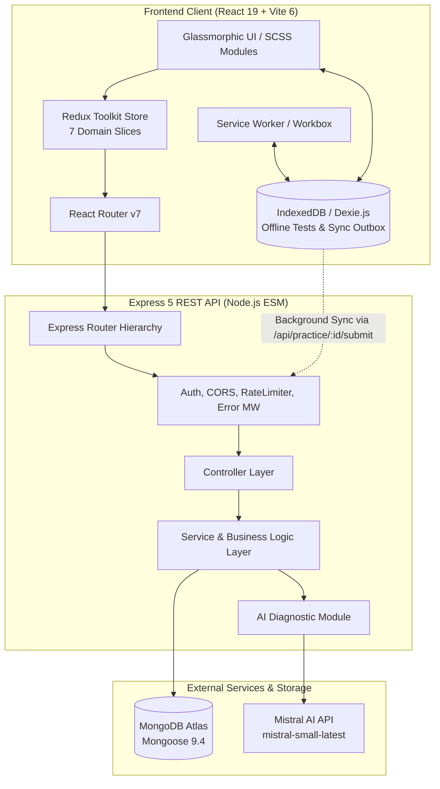
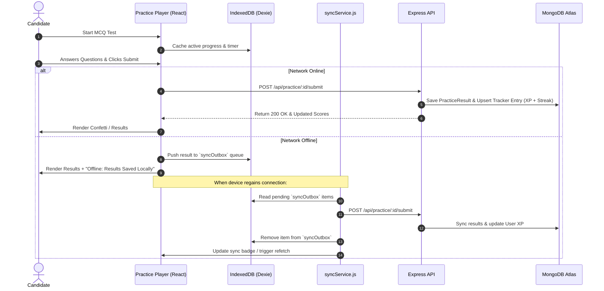
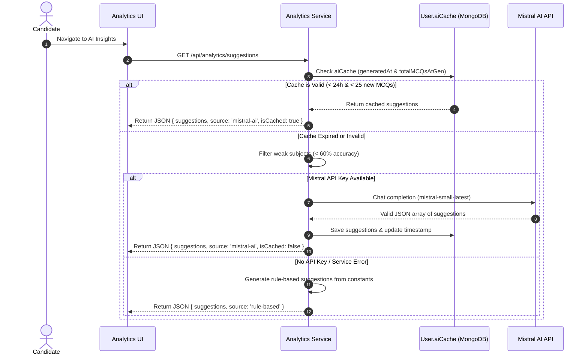

# 🛡️ PrepZone — AI-Powered JECA Preparation & Learning Ecosystem

> A high-performance, gamified learning platform tailored for **WBJECA (MCA Entrance)** aspirants. Combining adaptive AI performance diagnostics, offline-resilient practice workflows, multi-roadmap study planning, and predictive rank modeling into a distraction-free glassmorphic workspace.

---

[](https://github.com/Ramiz1323/PrepZone)
[](https://react.dev/)
[](https://expressjs.com/)
[](https://www.mongodb.com/)
[](https://mistral.ai/)
[](https://web.dev/progressive-web-apps/)
[](./PrepZone-main/Backend/package.json)

---

## 📑 Table of Contents

- [Overview](#-overview)
- [Key Features & Capabilities](#-key-features--capabilities)
- [System Architecture](#-system-architecture)
- [Deep Dive: Core Subsystems](#-deep-dive-core-subsystems)
  - [1. The Scholar's Journey (Gamification & XP)](#1-the-scholars-journey-gamification--xp-engine)
  - [2. WBJECA Rank Predictor Pro V2](#2-wbjeca-rank-predictor-pro-v2)
  - [3. MCQ Master & Offline Practice Engine](#3-mcq-master--offline-practice-engine)
  - [4. Roadmap Architect & Multi-Plan Study Planner](#4-roadmap-architect--multi-plan-study-planner)
  - [5. Mistral AI Performance Diagnostics & Caching](#5-mistral-ai-performance-diagnostics--caching)
  - [6. Mistake Bank & Revision Queue](#6-mistake-bank--active-recall--revision-queue)
  - [7. Analytics & Consistency Heatmap](#7-analytics--consistency-heatmap)
- [Technology Stack](#-technology-stack)
- [Project Directory Structure](#-project-directory-structure)
- [Database Models & Schema Design](#-database-models--schema-design)
- [REST API Reference](#-rest-api-reference)
- [Critical User Workflows](#-critical-user-workflows)
- [Security & Resilience Protocols](#-security--resilience-protocols)
- [Progressive Web App (PWA) & Offline Sync](#-progressive-web-app-pwa--offline-sync)
- [Installation & Local Setup](#-installation--local-setup)
- [Environment Configuration](#-environment-configuration)
- [Development & Production Scripts](#-development--production-scripts)
- [Deployment Strategy](#-deployment-strategy)
- [Development Status & Roadmap](#-development-status--roadmap)
- [License & Acknowledgments](#-license--acknowledgments)

---

## 🌟 Overview

**PrepZone** addresses the primary pain points of competitive entrance preparation: fragmented tracking, lack of actionable diagnostics, unpredictable rank projections, and loss of motivation over long preparation cycles.

Designed specifically for the **West Bengal Joint Entrance for Computer Applications (WBJECA)** syllabus, PrepZone structures preparation around daily quantifiable goals, real-time accuracy telemetry, automated mistake logging, and an intelligent ranking engine that models candidate performance against ~25,000 yearly competitors.

```
┌─────────────────────────────────────────────────────────────────────────┐
│                           PrepZone Ecosystem                            │
├───────────────────┬───────────────────┬─────────────────────────────────┤
│   Track & Plan    │   Test & Learn    │        Analyze & Predict        │
│ • Multi-Roadmaps  │ • ChatGPT Import  │ • Mistral AI Diagnostic Engine  │
│ • Daily Sessions  │ • Code Snippets   │ • Pro V2 Rank Prediction (GMR)  │
│ • Mission Targets │ • Offline Dexie   │ • 365-Day Consistency Heatmap   │
│ • Spaced Revision │ • Auto Double-Sync│ • Target Institute Pinning      │
└───────────────────┴───────────────────┴─────────────────────────────────┘
```

---

## ✨ Key Features & Capabilities

- **🎮 Dual-Tier Gamification System**: Real-time XP engine with 7 competitive league ranks (Bronze to Grandmaster), dynamic level thresholds, and streak fire tracking with a 1-day grace period.
- **🧠 Hybrid AI Diagnostics**: Powered by `@mistralai/mistralai` using `mistral-small-latest` with fallback rule-based suggestion engines and a 24-hour / 25-MCQ token-saving cache layer.
- **🎯 WBJECA Rank Predictor (Pro V2)**: High-rigor mathematical model calculating Candidate Readiness (0–100%) and General Merit Rank (GMR) with proximity-weighted college admission probabilities across 14 West Bengal institutions.
- **⚡ MCQ Master with Zero-Data-Loss Offline Practice**: Custom JSON test importer, syntax-highlighted code problem player, in-progress auto-saving to IndexedDB, and automatic background synchronization upon reconnection.
- **🗺️ Multi-Roadmap Study Planner**: Create and switch between multiple preparation roadmaps with integrated AI JSON prompt generation, timeline views, and monthly calendar heat maps.
- **📊 Real-Time Analytics & Dashboards**: Aggregated accuracy breakdowns across 11 core computer science subjects, weekly progress vs. custom daily goals, and GitHub-style 365-day consistency heatmaps.
- **📓 Mistake Bank & Active Recall Queue**: Automatic and manual error indexing with root-cause correction recording and prioritized spaced-repetition revision queues.
- **📱 PWA & Mobile-First Glassmorphism**: Complete installable PWA with Service Worker background caching, custom bottom navigation, and an immersive dark crimson design system.

---

## 🏗️ System Architecture

PrepZone is structured around a decoupled MERN architecture with an offline client layer and an asynchronous AI diagnostic pipeline.



---

## 🔬 Deep Dive: Core Subsystems

### 1. The Scholar's Journey (Gamification & XP Engine)

PrepZone converts preparation into an RPG-like progression model. Every study session, practice drill, and mock test rewards user effort:

```text
Base XP = (MCQs Completed × 10) + (Minutes Studied × 1)
```

**Multiplier:** `1.2×` if accuracy is 80% or higher; otherwise `1.0×`.

```text
XP Earned = round(Base XP × Multiplier)
```

* **Level Progression**: A user advances to level `L + 1` when total XP reaches `L × 1000`.
* **Rank Tiers**:

| Tier Level Range | Rank Designation | Palette Accent |
| :--- | :--- | :--- |
| **Levels 1 – 5** | Bronze Novice | `#cd7f32` (Bronze) |
| **Levels 6 – 15** | Silver Practitioner | `#c0c0c0` (Silver) |
| **Levels 16 – 30** | Gold Specialist | `#ffd700` (Gold) |
| **Levels 31 – 45** | Platinum Expert | `#e5e4e2` (Platinum) |
| **Levels 46 – 60** | Diamond Master | `#b9f2ff` (Diamond Blue) |
| **Levels 61 – 80** | Master Scholar | `#ff00ff` (Magenta Glow) |
| **Levels 81+** | Grandmaster | `#ff4500` (Crimson Fire) |

* **Streak Calculation**: Evaluates daily activity timestamps. If the difference between the current session and the last active date is within `1 + STREAK_GRACE_DAYS` (1 day grace), the streak increments; otherwise, it resets cleanly to 1.

---

### 2. WBJECA Rank Predictor (Pro V2)

The **Pro V2 Predictor** simulates candidate standing across **25,000 yearly candidates** using a non-linear readiness function:

```text
Accuracy Score = (Avg Accuracy / 100)^3 × 70
(Cubic scaling enforces precision)
```

```text
Volume Score = min(Total MCQs / 5000, 1) × 20
```

```text
Consistency Score = min(Current Streak / 15, 1) × 10
```

```text
Weak Subject Penalty = max(0.75, 1 - (Weak Subjects Count × 0.05))
```

```text
Readiness (%) = round((Accuracy + Volume + Consistency) × Weak Penalty)
```

```text
Predicted GMR = max(1, min(25000, round(25000 × (1 - Readiness / 100)^2.2)))
```

#### College Admission Modeling & Proximity Scoring

PrepZone evaluates predicted GMR against 14 pre-seeded West Bengal MCA colleges categorized into 4 institutional tiers:
1. 🥇 **Top Tier**: Jadavpur University (JU), MAKAUT Campus, Calcutta University (CU).
2. 🥈 **Good Govt**: Kalyani University, KGEC, JGEC.
3. 🥉 **Private (High ROI)**: IEM, UEM, Heritage (HIT), RCCIIT.
4. 🧪 **Backup Institutions**: Techno Main Salt Lake, Haldia, NSEC, Techno Hooghly.

If a candidate's rank falls outside the standard cutoff, a quadratic proximity model dynamically calculates marginal chances (`2% - 25%`) rather than a flat failure rate, advising the exact rank jump needed.

---

### 3. MCQ Master & Offline Practice Engine

The practice module allows students to import custom test sets generated by LLMs (ChatGPT, Claude, etc.) and run complete simulated exams.

* **Global Question Bank Aggregation**: When a user imports a test, the server shreds the test questions and executes an upsert (`bulkWrite`) into the shared `QuestionBank` collection with unique indexing `{ subject: 1, question: 1 }` to eliminate duplicates while expanding the platform-wide repository.
* **Lightweight Code Syntax Highlighter**: Zero-dependency custom highlighter (`highlighter.js`) parses C/C++, Java, and Python snippets with line numbers inside MCQ cards.
* **Double-Storage Sync**: Submitting a test result updates the specific `PracticeResult` record and automatically triggers an aggregated entry inside the user's daily `Tracker` log, awarding XP and updating streaks without manual re-entry.
* **Multi-Stage Celebrations**: Embedded canvas confetti triggers standard bursts for `≥ 80%` accuracy and a high-intensity firecracker ("Patakha") loop for scores `≥ 90%`.

---

### 4. Roadmap Architect & Multi-Plan Study Planner

PrepZone supports multiple independent study roadmaps (e.g., *Core Syllabus*, *30-Day Revision Crash Course*, *Target JU Sprint*).

* **AI Prompt Architect**: Generates formatted JSON schema prompts containing start dates, target subjects, syllabus focus, and daily target quotas ready to paste into LLMs.
* **Dual View Mode**: Switch between a sequential timeline view and an interactive monthly calendar heatmap.
* **Dashboard Integration**: The active primary roadmap injects "Today's Mission" directly onto the main dashboard with a live progress bar comparing daily solved MCQs against the day's roadmap target.

---

### 5. Mistral AI Performance Diagnostics & Caching

The diagnostic engine continuously monitors performance across 11 standard JECA subjects (C Programming, OOP, Unix, Data Structures, Computer Intro, OS, Computer Network, DBMS, Software Engineering, Machine Learning, Others).

```
   ┌────────────────────────────────────────────────────────┐
   │ Check Subject Accuracies (< 60% = Weak Topic Trigger) │
   └───────────────────────────┬────────────────────────────┘
                               │
                ┌──────────────┴──────────────┐
                ▼                             ▼
       [Cache Valid < 24h &         [Cache Stale / > 25 MCQs]
        < 25 New MCQs Done]                   │
                │                             ▼
                │                  Is MISTRAL_API_KEY Set?
                │                     ├── Yes ──► Call Mistral API (mistral-small-latest)
                │                     └── No  ──► Execute Deterministic Rule Engine
                ▼                             │
   ┌─────────────────────────┐                ▼
   │ Serve Cached Diagnostic ├────────◄ Cache Response on User Model
   └─────────────────────────┘
```

* **Mistral Model**: `mistral-small-latest` with temperature `0.2` and `maxTokens: 350` to guarantee strict JSON output and minimal token overhead.
* **Token Optimization**: Only subjects below the `WEAK_SUBJECT_THRESHOLD` (60%) are forwarded to the prompt payload.
* **Rule-Based Fallback**: If the API key is omitted or the service is unreachable, PrepZone transparently serves curated pedagogical rules defined in `constants.js`.

---

### 6. Mistake Bank (Active Recall) & Revision Queue

* **Mistake Bank**: Stores detailed problem context, user misconceptions, and corrected explanations with repeat-count tracking and subject-level error distribution aggregation.
* **Revision Queue**: A prioritized checklist with status toggles (`pending` / `completed`) and priority weights (`high`, `medium`, `low`) enabling targeted review sessions before mock exams.

---

### 7. Analytics & Consistency Heatmap

* **MongoDB Aggregation Pipelines**: Calculates real-time total MCQs, study hours, average accuracy, and subject-wise accuracy distributions without storing duplicate metrics.
* **365-Day Activity Heatmap**: Visualizes annual preparation density on a 5-tier intensity scale (`0 = 0 MCQs, 1 = <20, 2 = <50, 3 = <100, 4 = 100+`).

---

## 🛠️ Technology Stack

### Frontend Core
| Layer | Technology | Version | Purpose |
| :--- | :--- | :--- | :--- |
| **Framework** | React | `19.1.0` | Declarative UI component architecture |
| **Runtime / Bundler** | Vite | `6.3.1` | Fast HMR and optimized production bundling |
| **State Management** | Redux Toolkit | `2.11.2` | Global application state and async thunks |
| **Routing** | React Router DOM | `7.5.0` | Client-side routing with lazy-loaded modules |
| **Styling** | Sass (Modern Modules) | `1.86.3` | Glassmorphic design tokens and responsive SCSS |
| **Data Visualization** | Recharts | `2.15.3` | Performance charts, gauges, and subject graphs |
| **Offline Storage** | Dexie.js (IndexedDB) | `4.4.4` | Client-side test caching and sync outbox queue |
| **PWA / ServiceWorker** | Vite Plugin PWA | `0.21.1` | Progressive Web App manifest and Workbox caching |
| **HTTP Client** | Axios | `1.9.0` | REST API communication with interceptors |
| **Icons & Effects** | React Icons / Canvas Confetti | `5.6.0` / `1.9.4` | Feather/Hero icons & celebratory animations |

### Backend Core
| Layer | Technology | Version | Purpose |
| :--- | :--- | :--- | :--- |
| **Server Framework** | Express | `5.2.1` | REST API routing and middleware pipeline |
| **Database & ODM** | MongoDB / Mongoose | `9.4.1` | Schematized document storage and aggregation |
| **AI Integration** | Mistral AI Official SDK | `2.2.0` | LLM diagnostics via `mistral-small-latest` |
| **Authentication** | JSON Web Tokens (JWT) | `9.0.3` | Stateless authentication via httpOnly cookies |
| **Password Security** | bcryptjs | `3.0.3` | Salted credential hashing (12 rounds) |
| **Validation** | express-validator | `7.3.2` | Input sanitization and payload validation |
| **Rate Limiting** | express-rate-limit | `8.3.2` | Brute-force and DoS attack prevention |
| **Logging** | Winston & Morgan | `3.19.0` / `1.10.1` | Structured file/console logging and HTTP telemetry |
| **Environment** | dotenv | `17.4.1` | Environment variable management |

---

## 📂 Project Directory Structure

```text
PrepZone/
├── Backend/
│   ├── server.js                     # Server entrypoint & graceful shutdown handlers
│   ├── package.json                  # Backend dependencies (Express 5, Mongoose 9)
│   └── src/
│       ├── app.js                    # Express app initialization, CORS, routing, error MW
│       ├── modules/
│       │   ├── analytics/            # Summary, weekly breakdown, Mistral AI suggestions
│       │   ├── auth/                 # User model, JWT auth, goals, target colleges
│       │   ├── college/              # WBJECA institutions model, seeding & controller
│       │   ├── mistakes/             # Mistake logging, correction bank & analytics
│       │   ├── planner/              # Multi-roadmap study planning & target scheduling
│       │   ├── practice/             # MCQ Tests, Question Bank & Result processing
│       │   ├── revision/             # Prioritized revision items & completion status
│       │   └── tracker/              # Daily study logging, session history, streak logic
│       └── shared/
│           ├── config/               # Database connection (db.js) & Env validation (env.js)
│           ├── middleware/           # auth.middleware.js, error.middleware.js, rateLimiter.js
│           └── utils/                # logger.js, responseHandler.js, constants.js
│
├── Frontend/
│   ├── index.html                    # HTML5 shell with PWA manifest headers
│   ├── vite.config.js                # Vite config + VitePWA plugin + Proxy configuration
│   ├── package.json                  # Frontend dependencies (React 19, Redux Toolkit)
│   ├── patches/                      # patch-package definitions (workbox-build patch)
│   └── src/
│       ├── App.jsx                   # Route definition & code-split Suspense boundaries
│       ├── main.jsx                  # React DOM root mounting with Redux Provider
│       ├── components/               # GlassCard, Sidebar, Topbar, ReloadPrompt, InstallPrompt, Modals
│       ├── hooks/                    # useAuth.jsx, useOnlineStatus.js
│       ├── layouts/                  # DashboardLayout.jsx with background layers & auto-sync
│       ├── modules/                  # Page Views (Dashboard, Tracker, Practice, Planner, Predictor, etc.)
│       ├── services/                 # api.js (Axios), db.js (Dexie), syncService.js
│       ├── store/                    # Redux Toolkit root store & domain slices
│       ├── styles/                   # SCSS variables, mixins, global styles, page stylesheets
│       └── utils/                    # predictionUtils.js, highlighter.js, chartUtils.js, dateUtils.js
│
└── README_ENHANCED.md                # Comprehensive project documentation
```

---

## 🗄️ Database Models & Schema Design

### 1. User Schema (`User`)
- `name` (String, required): Full name of the candidate.
- `email` (String, required, unique, lowercase): Candidate login identifier.
- `password` (String, required, hidden by default): 12-round bcrypt hash.
- `streak`: Subdocument with `current` (Number), `longest` (Number), and `lastActiveDate` (Date).
- `dailyMCQGoal` (Number, default: 50): Target MCQ solve count per day.
- `xp` (Number, default: 0): Cumulative experience points.
- `level` (Number, default: 1): Scholar level derived from XP.
- `aiCache`: Subdocument caching `suggestions` (Array), `generatedAt` (Date), and `totalMCQsAtGen` (Number).
- `targetColleges` (Array of Strings): Pinned institutional targets for GMR monitoring.

### 2. Tracker Schema (`Tracker`)
- `userId` (ObjectId `→` User, indexed): Owner of the log.
- `date` (String, format `YYYY-MM-DD`, indexed): Date of study session.
- `subjects` (Map of `{ total, correct, accuracy }`): Dynamic subject breakdown.
- `totalMCQs` (Number): Aggregate MCQs solved across the day.
- `accuracy` (Number): Percentage accuracy calculated across all subjects.
- `timeSpent` (Number): Total study duration in minutes.
- `weakTopics` (Array of Strings): Auto-detected and manual weak topic flags.
- `sessions` (Array of Subdocuments): Granular records for each individual study block throughout the day.
- **Index**: Unique compound index `{ userId: 1, date: 1 }`.

### 3. Practice Test & Question Bank Schemas (`PracticeTest`, `QuestionBank`, `PracticeResult`)
- **`PracticeTest`**: User-imported test storing `title`, `subject`, `topic`, `difficulty`, `isTimed`, `timeLimit`, `questions` array (with `question`, `codeSnippet`, `options`, `answer`), and `lastAttempt` stats.
- **`QuestionBank`**: Platform-wide question repository aggregated across all user imports. Compound unique index `{ subject: 1, question: 1 }`.
- **`PracticeResult`**: Historical attempt logs storing `testId`, `score`, `totalQuestions`, `accuracy`, `timeTaken`, `userAnswers` (array of chosen option indices), and `date`.

### 4. Study Planner Schema (`Planner`)
- `userId` (ObjectId `→` User, indexed): Owner.
- `title` (String, default: "My Study Plan"): Roadmap title.
- `isActive` (Boolean, default: true): Determines if this plan powers the dashboard mission.
- `plans`: Array of `{ date, subject, topics, mcqTarget, status }`.
- **Index**: Unique compound index `{ userId: 1, title: 1 }`.

### 5. Mistakes & Revision Schemas (`Mistake`, `Revision`)
- **`Mistake`**: `userId`, `subject`, `topic`, `mistake` (description), `correction` (concept), `tags`, `repeatCount`. Compound index `{ userId: 1, subject: 1 }`.
- **`Revision`**: `userId`, `topic`, `subject`, `priority` (`high` | `medium` | `low`), `status` (`pending` | `completed`), `dueDate`, `completedAt`.

### 6. College Schema (`College`)
- `name` (String, unique): Institution title (e.g., "Jadavpur University (JU)").
- `location` (String): City/district.
- `type` (Enum: `Govt`, `Govt Aided`, `Private`).
- `tier` (String): Tier categorization.
- `cutoff` (Number): Upper threshold GMR.
- `minCutoff` (Number, default: 1): Lower threshold GMR.

---

## 📡 REST API Reference

All protected endpoints require a valid JWT passed either via the HTTP-Only `token` cookie or the `Authorization: Bearer <token>` header.

### 🔐 Authentication (`/api/auth`)
| Method | Endpoint | Auth | Purpose |
| :--- | :--- | :--- | :--- |
| `POST` | `/api/auth/register` | Public (Rate Limited) | Register a new user and set JWT cookie |
| `POST` | `/api/auth/login` | Public (Rate Limited) | Authenticate user and set JWT cookie |
| `POST` | `/api/auth/logout` | Public | Clear JWT auth cookie |
| `GET` | `/api/auth/me` | Authenticated | Retrieve authenticated user profile |
| `PATCH`| `/api/auth/goal` | Authenticated | Update user's daily MCQ target |
| `PATCH`| `/api/auth/target-colleges`| Authenticated | Update pinned target colleges list |

### 📊 Tracker & Logging (`/api/tracker`)
| Method | Endpoint | Auth | Purpose |
| :--- | :--- | :--- | :--- |
| `POST` | `/api/tracker` | Authenticated | Create or merge a daily study session |
| `GET` | `/api/tracker` | Authenticated | Get paginated log history (`limit`, `skip`) |
| `GET` | `/api/tracker/:date` | Authenticated | Get specific log by `YYYY-MM-DD` |
| `DELETE`| `/api/tracker/:date`| Authenticated | Delete a daily log entry |

### 📈 Analytics & AI Diagnostics (`/api/analytics`)
| Method | Endpoint | Auth | Purpose |
| :--- | :--- | :--- | :--- |
| `GET` | `/api/analytics/summary` | Authenticated | Aggregate career stats, accuracy, weak topics |
| `GET` | `/api/analytics/weekly` | Authenticated | Get daily breakdown for last `N` days (`?days=7`) |
| `GET` | `/api/analytics/suggestions`| Authenticated | Get cached/fresh Mistral AI or rule-based suggestions |
| `GET` | `/api/analytics/calendar` | Authenticated | Get 365-day activity heat map (`?year=2025`) |

### 🧪 MCQ Practice & Question Bank (`/api/practice`)
| Method | Endpoint | Auth | Purpose |
| :--- | :--- | :--- | :--- |
| `POST` | `/api/practice/import` | Authenticated | Import custom MCQ test & update QuestionBank |
| `GET` | `/api/practice/my-tests` | Authenticated | List all tests created by the user |
| `GET` | `/api/practice/:id` | Authenticated | Retrieve complete test questions |
| `GET` | `/api/practice/:id/latest-result` | Authenticated | Retrieve user's most recent attempt result |
| `POST` | `/api/practice/:id/submit` | Authenticated | Submit attempt, record score, and sync with Tracker |

### 🗺️ Study Planner (`/api/planner`)
| Method | Endpoint | Auth | Purpose |
| :--- | :--- | :--- | :--- |
| `GET` | `/api/planner/list` | Authenticated | List all user roadmaps |
| `GET` | `/api/planner` | Authenticated | Retrieve active primary roadmap |
| `GET` | `/api/planner/:id` | Authenticated | Retrieve specific roadmap by ID |
| `POST` | `/api/planner` | Authenticated | Create a new roadmap |
| `PUT` | `/api/planner/:id` | Authenticated | Update roadmap schedule |
| `PATCH`| `/api/planner/:id/active` | Authenticated | Set a roadmap as the active primary |
| `DELETE`| `/api/planner/:id` | Authenticated | Delete a specific roadmap |

### 📓 Mistakes & Revision (`/api/mistakes`, `/api/revision`)
| Method | Endpoint | Auth | Purpose |
| :--- | :--- | :--- | :--- |
| `POST` | `/api/mistakes` | Authenticated | Log a new concept mistake |
| `GET` | `/api/mistakes` | Authenticated | Get mistakes (`?subject=OS&page=1&limit=20`) |
| `GET` | `/api/mistakes/analytics`| Authenticated | Subject-wise error frequency metrics |
| `PATCH`| `/api/mistakes/:id` | Authenticated | Update mistake or explanation |
| `DELETE`| `/api/mistakes/:id` | Authenticated | Delete a mistake record |
| `POST` | `/api/revision` | Authenticated | Add topic to revision queue |
| `GET` | `/api/revision` | Authenticated | List revision queue items |
| `GET` | `/api/revision/stats` | Authenticated | Priority & completion status counts |
| `PATCH`| `/api/revision/:id` | Authenticated | Toggle completed status or update details |
| `DELETE`| `/api/revision/:id` | Authenticated | Remove item from revision queue |

### 🏛️ Colleges & System (`/api/colleges`, `/health`)
| Method | Endpoint | Auth | Purpose |
| :--- | :--- | :--- | :--- |
| `GET` | `/api/colleges` | Public | List all seeded West Bengal colleges |
| `GET` | `/health` | Public | Server health status, environment, and uptime |

---

## 🔄 Critical User Workflows

### 1. Test Taking, Offline Fallback & Auto-Sync Workflow



### 2. AI Diagnostics Workflow with Token Cache



---

## 🔒 Security & Resilience Protocols

- **HTTP-Only Cookie Storage**: JWT tokens are issued with `httpOnly: true`, `sameSite: 'strict'`, and `secure: true` in production environments, preventing XSS-based token theft.
- **Strict CORS Policy**: Whitelist-validated origins ensuring requests originate exclusively from the authorized frontend client (`env.CLIENT_URL` and development origins).
- **Dual-Layer Rate Limiting**:
  - `authLimiter`: Max 20 requests per 15 minutes on `/register` and `/login` routes.
  - `apiLimiter`: Max 200 requests per 15 minutes across all general `/api/*` routes.
- **Input Validation & Sanitization**: Strict schema checks via `express-validator` across body payloads before reaching the service layer.
- **Zero Process Crashes**: Graceful shutdown handles `SIGTERM`, `SIGINT`, `unhandledRejection`, and `uncaughtException` events cleanly closing database pools and active connections.
- **Fail-Safe Fallbacks**: Mistral AI failures automatically fall back to deterministic pedagogical rules, ensuring uninterrupted dashboard analytics.

---

## 📱 Progressive Web App (PWA) & Offline Sync

PrepZone is configured as a standalone Progressive Web Application using `vite-plugin-pwa` and custom Workbox service worker caching strategies:

* **Asset Pre-caching**: HTML, CSS, JavaScript, WebManifest, and branding icons are pre-cached for instant offline loading.
* **Background Sync Strategy**: Network-only requests to `/api/practice/*/submit` are managed with a 24-hour background retention retry mechanism (`mcq-submit-queue`).
* **In-App Install Prompts**: Platform-aware detection for iOS (Safari Add-to-Home-Screen guide) and Android/Desktop native install triggers (`beforeinstallprompt`).
* **Real-time Outbox Indicator**: The topbar navigation continuously monitors IndexedDB `syncOutbox.count()` and renders a status pill alerting users of pending synchronization queues.

---

## 💻 Installation & Local Setup

### Prerequisites
- **Node.js**: `v18.0.0` or higher
- **npm**: `v9.0.0` or higher
- **MongoDB**: Local instance (`localhost:27017`) or MongoDB Atlas connection string
- **Mistral AI Key** *(Optional)*: Obtainable from [console.mistral.ai](https://console.mistral.ai/)

---

### Step 1: Clone Repository
```bash
git clone https://github.com/Ramiz1323/PrepZone.git
cd PrepZone
```

---

### Step 2: Backend Setup
```bash
# Navigate to backend directory
cd Backend

# Install dependencies
npm install

# Create environment configuration file
cp .env.example .env   # Or create .env manually
```

Configure your `Backend/.env`:
```env
PORT=5000
NODE_ENV=development
MONGO_URI=mongodb://localhost:27017/prepzone
JWT_SECRET=your_super_secret_jwt_key_at_least_32_characters
JWT_EXPIRES_IN=7d
CLIENT_URL=http://localhost:5173
MISTRAL_API_KEY=your_mistral_api_key_here
```

Start the backend development server:
```bash
npm run dev
```

---

### Step 3: Frontend Setup
Open a new terminal window:
```bash
# Navigate to frontend directory
cd Frontend

# Install dependencies (automatically runs patch-package)
npm install

# Create environment configuration file
cp .env.example .env   # Or create .env manually
```

Configure your `Frontend/.env`:
```env
VITE_API_URL=/api
```

Start the Vite development server:
```bash
npm run dev
```

Open [http://localhost:5173](http://localhost:5173) in your browser.

---

## ⚙️ Environment Configuration

### Backend Environment Variables (`Backend/.env`)
| Variable | Required | Default | Description |
| :--- | :---: | :--- | :--- |
| `PORT` | No | `5000` | Port on which Express API listens |
| `NODE_ENV` | No | `development` | Runtime environment (`development`, `production`, `test`) |
| `MONGO_URI` | **Yes** | — | MongoDB Atlas or local MongoDB connection URI |
| `JWT_SECRET` | **Yes** | — | Cryptographic secret key for signing JWT tokens |
| `JWT_EXPIRES_IN` | No | `7d` | Lifespan of generated JWT tokens |
| `CLIENT_URL` | No | `http://localhost:5173` | Allowed CORS origin for frontend client |
| `MISTRAL_API_KEY` | No | `""` | Mistral API key (falls back to rule engine if omitted) |

### Frontend Environment Variables (`Frontend/.env`)
| Variable | Required | Default | Description |
| :--- | :---: | :--- | :--- |
| `VITE_API_URL` | No | `/api` | Base URL endpoint for Axios REST API requests |

---

## 📜 Development & Production Scripts

### Backend (`Backend/package.json`)
```bash
# Start development server with automatic file restart
npm run dev

# Start production server
npm start

# Start production server with explicit NODE_ENV
npm run start:prod
```

### Frontend (`Frontend/package.json`)
```bash
# Launch Vite development server at http://localhost:5173
npm run dev

# Compile production bundle to /dist
npm run build

# Preview production build locally
npm run preview

# Automatically apply package patches (runs on postinstall)
npm run postinstall
```

---

## 🚀 Deployment Strategy

PrepZone is configured for seamless deployment across modern cloud platforms:

### Backend Deployment (e.g., Render / Railway / VPS)
1. **Environment**: Select `Node.js` environment.
2. **Build Command**: `npm install`
3. **Start Command**: `npm run start:prod`
4. **Environment Variables**: Configure `MONGO_URI`, `JWT_SECRET`, `CLIENT_URL`, `NODE_ENV=production`, and `MISTRAL_API_KEY`.
5. **Reverse Proxy (if on VPS)**: Configure Nginx to forward API traffic to port `5000` with `proxy_set_header X-Forwarded-Proto $scheme;` (Express `trust proxy: 1` is pre-configured).

### Frontend Deployment (e.g., Vercel / Netlify / VPS Nginx)
1. **Build Command**: `npm run build`
2. **Output Directory**: `dist`
3. **SPA Routing Rule**: Ensure all non-static requests rewrite to `/index.html`.
4. **Environment Variable**: `VITE_API_URL=https://api.yourdomain.com/api` (or relative `/api` if using reverse proxy).

---

## 🗺️ Development Status & Roadmap

### ✅ Currently Implemented & Verified in Codebase
- [x] Full JWT Authentication with secure httpOnly cookie delivery.
- [x] Gamified XP engine with 7 tiered leagues (Bronze to Grandmaster) and streak tracking.
- [x] Pro V2 WBJECA Rank Predictor with cubic accuracy scaling and candidate distribution modeling.
- [x] Multi-plan study roadmap architect with LLM prompt generator and calendar views.
- [x] MCQ Master with custom JSON test imports and global question bank aggregation.
- [x] Offline exam session resilience with Dexie.js (IndexedDB) and background synchronization.
- [x] Hybrid diagnostic engine leveraging Mistral AI with 24-hour token caching and rule-based fallbacks.
- [x] Active recall Mistake Bank and prioritized Revision Queue.
- [x] 365-day consistency heatmap and Recharts performance dashboards.
- [x] Installable PWA with Workbox service worker caching and offline update prompts.

### 🔮 Potential Future Roadmap
- [ ] **Collaborative Peer Mock Battles**: Real-time 1v1 multiplayer MCQ duels via WebSockets.
- [ ] **Automated PDF PYQ (Previous Year Question) Parsing**: Ingestion of past 10 years of JECA papers via OCR.
- [ ] **Push Notification Reminders**: Native Web Push alerts for scheduled revision items and streak preservation.
- [ ] **Syllabus Mastery Radar Chart**: Multi-axis radar visualization comparing individual topic mastery against state benchmarks.

---

## 📄 License & Acknowledgments

PrepZone is distributed under the **MIT License**. See [`Backend/package.json`](file:///d:/Raza%20Da/PrepZone-main/PrepZone-main/Backend/package.json) for details.

* **Designed & Built by**: PrepZone Team
* **Target Curriculum**: West Bengal Joint Entrance Examination Board (WBJEEB) MCA Entrance (WBJECA)
* **Special Thanks**: Mistral AI for diagnostic intelligence and the open-source React / Vite / Node.js communities.
