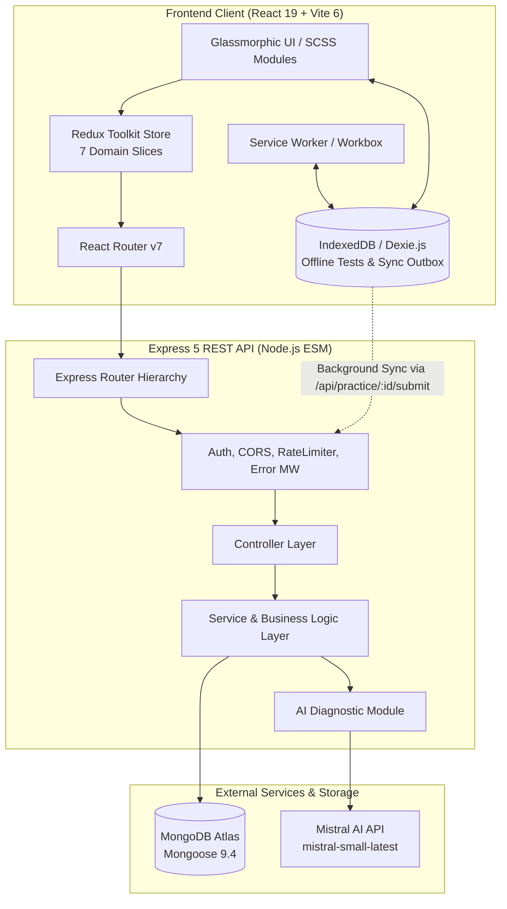
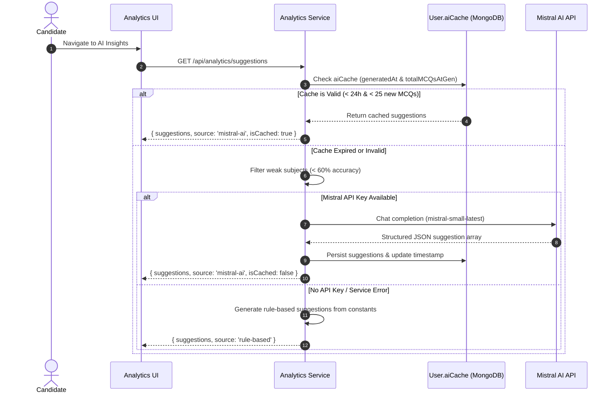
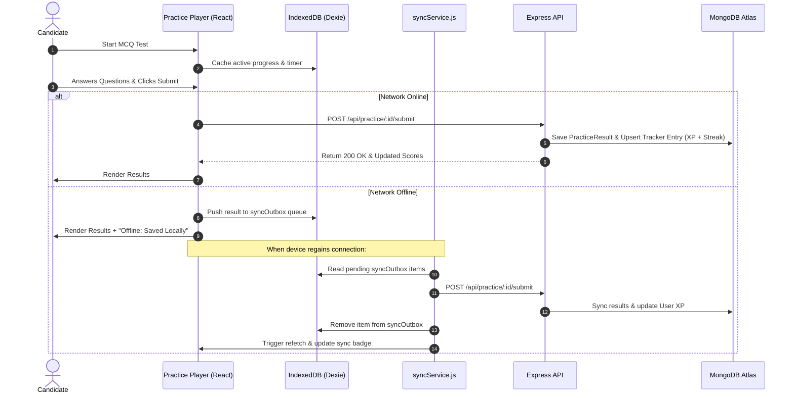

# 🛡️ PrepZone — AI-Powered JECA Preparation & Learning Ecosystem

> A high-performance, gamified learning platform tailored for **WBJECA (MCA Entrance)** aspirants. Combining adaptive AI performance diagnostics, offline-resilient practice workflows, multi-roadmap study planning, and predictive rank modeling into a distraction-free glassmorphic workspace.

---

[](https://github.com/Ramiz1323/PrepZone)
[](https://react.dev/)
[](https://expressjs.com/)
[](https://www.mongodb.com/)
[](https://mistral.ai/)
[](https://web.dev/progressive-web-apps/)
[](./PrepZone-main/Backend/package.json)

---

## 📑 Table of Contents

- [Overview](#-overview)
- [Core Capabilities](#-core-capabilities)
- [Technical Architecture](#️-technical-architecture)
- [Technology Stack](#️-technology-stack)
- [Engineering Highlights](#️-engineering-highlights)
- [AI Integration](#-ai-integration--mistral-diagnostic-engine)
- [Data & Analytics](#-data--analytics)
- [Security & Reliability](#-security--reliability)
- [Core Subsystems — Technical Detail](#-core-subsystems--technical-detail)
- [REST API Reference](#-rest-api-reference)
- [Database Schema Design](#️-database-schema-design)
- [Deployment & Infrastructure](#-deployment--infrastructure)
- [Implementation Status](#-implementation-status)

---

## 🌟 Overview

**PrepZone** addresses the primary pain points of competitive entrance preparation: fragmented tracking, lack of actionable diagnostics, unpredictable rank projections, and loss of motivation over long preparation cycles.

Designed specifically for the **West Bengal Joint Entrance for Computer Applications (WBJECA)** syllabus, PrepZone structures preparation around daily quantifiable goals, real-time accuracy telemetry, automated mistake logging, and an intelligent ranking engine that models candidate performance against approximately 25,000 yearly competitors.

```
┌─────────────────────────────────────────────────────────────────────────┐
│                           PrepZone Ecosystem                            │
├───────────────────┬───────────────────┬─────────────────────────────────┤
│   Track & Plan    │   Test & Learn    │        Analyze & Predict        │
│ • Multi-Roadmaps  │ • LLM Import      │ • Mistral AI Diagnostic Engine  │
│ • Daily Sessions  │ • Code Snippets   │ • Pro V2 Rank Prediction (GMR)  │
│ • Mission Targets │ • Offline Dexie   │ • 365-Day Consistency Heatmap   │
│ • Spaced Revision │ • Auto Double-Sync│ • Target Institute Pinning      │
└───────────────────┴───────────────────┴─────────────────────────────────┘
```

---

## ✨ Core Capabilities

- **🎮 Dual-Tier Gamification System** — Real-time XP engine with 7 competitive league ranks (Bronze to Grandmaster), dynamic level thresholds, and streak tracking with a 1-day grace period.
- **🧠 Hybrid AI Diagnostics** — Mistral AI (`mistral-small-latest`) surfaces personalized study recommendations with a 24-hour / 25-MCQ token-saving cache layer and a deterministic rule-based fallback.
- **🎯 WBJECA Rank Predictor (Pro V2)** — Non-linear mathematical model calculating Candidate Readiness (0–100%) and General Merit Rank (GMR) with proximity-weighted college admission probabilities across 14 West Bengal institutions.
- **⚡ MCQ Master with Zero-Data-Loss Offline Practice** — Custom JSON test importer, syntax-highlighted code problem player, in-progress auto-saving to IndexedDB, and automatic background synchronization upon reconnection.
- **🗺️ Multi-Roadmap Study Planner** — Create and switch between multiple independent preparation roadmaps with integrated AI prompt generation, timeline views, and monthly calendar heatmaps.
- **📊 Real-Time Analytics & Dashboards** — Aggregated accuracy breakdowns across 11 core computer science subjects, weekly progress vs. custom daily goals, and GitHub-style 365-day consistency heatmaps.
- **📓 Mistake Bank & Active Recall Queue** — Automatic and manual error indexing with root-cause correction recording and prioritized spaced-repetition revision queues.
- **📱 PWA & Mobile-First Glassmorphism** — Installable Progressive Web App with Service Worker background caching, custom bottom navigation, and an immersive dark crimson design system.

---

## 🏗️ Technical Architecture

PrepZone is structured around a decoupled MERN architecture with an offline client layer and an asynchronous AI diagnostic pipeline.



### Frontend

React 19 paired with Vite 6 provides the component layer and build tooling. **Redux Toolkit** manages centralized application state across 7 domain slices — authentication, study tracking, practice, analytics, planning, gamification, and college prediction. **Sass (Modern Modules)** powers the glassmorphic design system through composable SCSS tokens and mixins. **Recharts** renders performance charts, subject-accuracy gauges, and weekly dashboards. **Dexie.js** (IndexedDB wrapper) provides offline exam session persistence and a sync outbox queue. Route-level code splitting via React Router v7 with Suspense boundaries keeps the initial bundle lean.

### Backend

A Node.js ESM server running **Express 5** organizes all API logic through a **Controller-Service architecture**, enforcing separation between request handling and business logic. Each domain (auth, tracker, analytics, practice, planner, mistakes, revision) is a self-contained module with its own router, controller, and service layer. The **Mistral AI SDK** is integrated directly into the Analytics Service for asynchronous diagnostic generation. Winston and Morgan provide structured file/console logging and HTTP telemetry across all environments.

### Database

**MongoDB Atlas** serves as the cloud-hosted persistence layer, accessed via **Mongoose 9.4** for schema-enforced document storage. Aggregation pipelines compute real-time analytics — accuracy distributions, weekly breakdowns, 365-day heatmaps — without storing redundant pre-computed metrics. Strategic compound indexes (`{ userId, date }` on Tracker and `{ subject, question }` on QuestionBank) optimize query performance for the most critical access patterns.

### Project Directory Structure

```
PrepZone/
├── Backend/
│   ├── server.js                     # Server entrypoint & graceful shutdown handlers
│   └── src/
│       ├── app.js                    # Express app initialization, CORS, routing, error MW
│       ├── modules/
│       │   ├── analytics/            # Summary, weekly breakdown, Mistral AI suggestions
│       │   ├── auth/                 # User model, JWT auth, goals, target colleges
│       │   ├── college/              # WBJECA institutions model, seeding & controller
│       │   ├── mistakes/             # Mistake logging, correction bank & analytics
│       │   ├── planner/              # Multi-roadmap study planning & target scheduling
│       │   ├── practice/             # MCQ Tests, Question Bank & Result processing
│       │   ├── revision/             # Prioritized revision items & completion status
│       │   └── tracker/              # Daily study logging, session history, streak logic
│       └── shared/
│           ├── config/               # Database connection & environment validation
│           ├── middleware/           # auth.middleware.js, error.middleware.js, rateLimiter.js
│           └── utils/                # logger.js, responseHandler.js, constants.js
│
└── Frontend/
    └── src/
        ├── App.jsx                   # Route definition & code-split Suspense boundaries
        ├── components/               # GlassCard, Sidebar, Topbar, ReloadPrompt, InstallPrompt, Modals
        ├── hooks/                    # useAuth.jsx, useOnlineStatus.js
        ├── layouts/                  # DashboardLayout.jsx with background layers & auto-sync
        ├── modules/                  # Page Views (Dashboard, Tracker, Practice, Planner, Predictor, etc.)
        ├── services/                 # Axios API client, Dexie DB wrapper, syncService
        ├── store/                    # Redux Toolkit root store & domain slices
        ├── styles/                   # SCSS variables, mixins, global styles, page stylesheets
        └── utils/                    # predictionUtils.js, highlighter.js, chartUtils.js, dateUtils.js
```

---

## 🛠️ Technology Stack

### Frontend

| Layer | Technology | Version | Responsibility |
| :--- | :--- | :--- | :--- |
| **Framework** | React | `19.1.0` | Declarative UI component architecture |
| **Build Tooling** | Vite | `6.3.1` | Fast HMR and optimized production bundling |
| **State Management** | Redux Toolkit | `2.11.2` | Centralized state across 7 domain slices with async thunks |
| **Routing** | React Router DOM | `7.5.0` | Client-side routing with lazy-loaded, code-split modules |
| **Styling** | Sass (Modern Modules) | `1.86.3` | Glassmorphic design tokens and composable SCSS architecture |
| **Data Visualization** | Recharts | `2.15.3` | Performance charts, accuracy gauges, and subject graphs |
| **Offline Storage** | Dexie.js (IndexedDB) | `4.4.4` | Client-side test caching and background sync outbox queue |
| **PWA / Service Worker** | Vite Plugin PWA | `0.21.1` | PWA manifest, Workbox asset pre-caching, and update prompts |
| **HTTP Client** | Axios | `1.9.0` | REST API communication with request/response interceptors |

### Backend

| Layer | Technology | Version | Responsibility |
| :--- | :--- | :--- | :--- |
| **Server Framework** | Express | `5.2.1` | REST API routing and middleware pipeline |
| **Database & ODM** | MongoDB / Mongoose | `9.4.1` | Schematized document storage, aggregation pipelines |
| **AI Integration** | Mistral AI Official SDK | `2.2.0` | LLM-powered diagnostics via `mistral-small-latest` |
| **Authentication** | JSON Web Tokens (JWT) | `9.0.3` | Stateless authentication delivered via httpOnly cookies |
| **Password Security** | bcryptjs | `3.0.3` | Salted credential hashing (12 rounds) |
| **Validation** | express-validator | `7.3.2` | Input sanitization and payload schema enforcement |
| **Rate Limiting** | express-rate-limit | `8.3.2` | Brute-force and DoS attack prevention |
| **Logging** | Winston & Morgan | `3.19.0` / `1.10.1` | Structured file/console logging and HTTP telemetry |

---

## ⚙️ Engineering Highlights

- **Controller-Service Architecture** — The Express backend enforces a strict two-layer separation: controllers handle HTTP concerns (request parsing, response formatting) while services encapsulate all business logic and database interaction. This pattern enables independent testability and maintainability across 8 domain modules.
- **7-Slice Redux State Architecture** — Frontend state is partitioned into domain-specific slices (auth, tracker, practice, analytics, planner, gamification, prediction), each with scoped async thunks. This prevents cross-domain coupling and keeps the component layer stateless.
- **Zero-Data-Loss Offline Resilience** — MCQ exam sessions auto-persist to IndexedDB via Dexie. On reconnection, a background sync service drains the outbox queue and reconciles results with the server — including XP and streak recalculation — without user intervention.
- **AI Response Caching Strategy** — Mistral API calls are guarded by a dual-condition cache (24-hour TTL and fewer than 25 new MCQs solved), stored directly on the User document. This eliminates redundant LLM calls while keeping recommendations fresh relative to actual study velocity.
- **Deterministic AI Fallback** — If the Mistral API key is absent or the service is unreachable, the analytics pipeline transparently serves curated pedagogical suggestions from a rule-based constant engine. The frontend receives a consistent response shape regardless of the suggestion source.
- **Adaptive Rank Modeling** — The Pro V2 Rank Predictor uses cubic accuracy scaling combined with volume, consistency, and weak-subject penalty coefficients to model candidate readiness non-linearly, avoiding the overconfidence of linear rank projections.
- **Global Question Bank Aggregation** — Each imported MCQ test performs a compound-indexed upsert (`{ subject, question }`) into a platform-wide `QuestionBank` collection, eliminating duplicates while continuously expanding shared question coverage.
- **Graceful Process Management** — The server handles `SIGTERM`, `SIGINT`, `unhandledRejection`, and `uncaughtException` signals, cleanly closing database connections before exit — production-safe behavior by design.

---

## 🧠 AI Integration — Mistral Diagnostic Engine

The Mistral AI integration is a core functional component of PrepZone, not a cosmetic feature. The diagnostic pipeline continuously monitors a candidate's accuracy across 11 JECA subjects and generates targeted, subject-specific study recommendations using `mistral-small-latest`.

**Diagnostic Logic Flow:**

1. On each analytics request, the service evaluates the candidate's per-subject accuracy from aggregated Tracker data.
2. Subjects below a 60% accuracy threshold are identified as weak topics and forwarded to the Mistral prompt payload — keeping token usage minimal by excluding already-mastered subjects.
3. The model is invoked with `temperature: 0.2` and `maxTokens: 350`, enforcing structured JSON output and predictable pedagogical responses.
4. Generated suggestions are cached on the User document (`aiCache`) with a timestamp and MCQ count at generation time. Subsequent requests within the cache validity window are served from MongoDB — no repeated API calls.
5. If the Mistral service is unavailable, the system falls back to a deterministic rule engine with curated subject-specific guidance.



---

## 📊 Data & Analytics

PrepZone's analytics layer goes significantly beyond basic CRUD dashboards. All metrics are derived from MongoDB aggregation pipelines computed at query time, ensuring accuracy without denormalized or duplicated data.

**What the system tracks and surfaces:**

- **Subject-level accuracy distributions** across 11 CS subjects — identifying weak areas with statistical precision rather than self-reported guesses.
- **Daily MCQ goal adherence** — each Tracker document records granular study sessions within the day, enabling both intra-day breakdowns and weekly trend analysis.
- **365-day consistency heatmap** — maps annual preparation density on a 5-tier intensity scale (0 MCQs → <20 → <50 → <100 → 100+), rendered in a GitHub-style contribution grid via Recharts.
- **Mistake frequency analytics** — aggregates error distribution by subject and topic, surfacing repeat mistakes with `repeatCount` tracking to prioritize the revision queue intelligently.
- **Study session telemetry** — each session records `totalMCQs`, `accuracy`, `timeSpent`, and `weakTopics`, creating a longitudinal record of preparation velocity over the full exam cycle.
- **XP and progression metrics** — the gamification layer contributes engagement data (streaks, level progression, XP velocity) that correlates study consistency with academic performance indicators.

---

## 🔒 Security & Reliability

Security decisions in PrepZone reflect production-oriented engineering, not checkbox compliance.

- **JWT via httpOnly Cookies** — Authentication tokens are issued with `httpOnly: true`, `sameSite: 'strict'`, and `secure: true` in production. This eliminates the attack surface for XSS-based token theft that affects localStorage-based auth schemes.
- **Strict CORS Policy** — Requests are validated against an explicit origin whitelist (`CLIENT_URL`). Cross-origin requests from unauthorized origins are rejected at the middleware layer before reaching any route handler.
- **Dual-Layer Rate Limiting**:
  - Auth routes (`/register`, `/login`): max 20 requests per 15 minutes per IP.
  - General API routes (`/api/*`): max 200 requests per 15 minutes per IP.
- **Input Validation & Sanitization** — All request bodies are validated via `express-validator` schema definitions before reaching the service layer, rejecting malformed or malicious payloads early.
- **Graceful Process Shutdown** — The server registers handlers for `SIGTERM`, `SIGINT`, `unhandledRejection`, and `uncaughtException`, ensuring database connections close cleanly and no requests are dropped mid-flight.
- **Structured Logging** — Winston provides multi-transport structured logging (file + console) across all environments; Morgan logs HTTP telemetry per request. This enables production observability without external tooling.

---

## 🔬 Core Subsystems — Technical Detail

### 1. The Scholar's Journey — Gamification & XP Engine

PrepZone converts preparation into an RPG-like progression model. Every study session, practice drill, and mock test rewards user effort through a well-defined XP formula:

- **Base XP** = (MCQs Completed × 10) + (Minutes Studied × 1)
- **Accuracy Multiplier**: 1.2× if session accuracy ≥ 80%; 1.0× otherwise
- **XP Earned** = round(Base XP × Multiplier)
- **Level Progression**: User advances to level L+1 when cumulative XP reaches L × 1000

| Level Range | Rank Designation | Visual Accent |
| :--- | :--- | :--- |
| Levels 1–5 | Bronze Novice | `#cd7f32` |
| Levels 6–15 | Silver Practitioner | `#c0c0c0` |
| Levels 16–30 | Gold Specialist | `#ffd700` |
| Levels 31–45 | Platinum Expert | `#e5e4e2` |
| Levels 46–60 | Diamond Master | `#b9f2ff` |
| Levels 61–80 | Master Scholar | `#ff00ff` |
| Levels 81+ | Grandmaster | `#ff4500` |

**Streak Calculation**: Daily activity timestamps are evaluated server-side. If the elapsed time since `lastActiveDate` falls within the configured grace window (1 day), the streak increments; otherwise it resets to 1.

---

### 2. WBJECA Rank Predictor — Pro V2

The Pro V2 Predictor simulates candidate standing across 25,000 yearly WBJECA candidates using a non-linear composite readiness model:

- **Accuracy Score** = (Avg Accuracy / 100)³ × 70 — Cubic scaling penalizes low-accuracy candidates disproportionately.
- **Volume Score** = min(Total MCQs / 5000, 1) × 20
- **Consistency Score** = min(Current Streak / 15, 1) × 10
- **Weak Subject Penalty** = max(0.75, 1 − (Weak Subject Count × 0.05))
- **Readiness (%)** = round((Accuracy + Volume + Consistency) × Weak Penalty)
- **Predicted GMR** = max(1, min(25000, round(25000 × (1 − Readiness / 100)^2.2)))

The predicted GMR is evaluated against 14 pre-seeded West Bengal MCA institutions across 4 tiers:

1. 🥇 **Top Tier** — Jadavpur University (JU), MAKAUT Campus, Calcutta University (CU)
2. 🥈 **Good Govt** — Kalyani University, KGEC, JGEC
3. 🥉 **Private (High ROI)** — IEM, UEM, Heritage (HIT), RCCIIT
4. 🧪 **Backup Institutions** — Techno Main Salt Lake, Haldia, NSEC, Techno Hooghly

If the candidate's GMR falls outside a college's standard cutoff, a quadratic proximity model computes marginal admission chances (2%–25%) rather than returning a flat failure result, and advises the precise rank improvement required.

---

### 3. MCQ Master & Offline Practice Engine

- **Global Question Bank Aggregation** — On test import, questions are upserted via `bulkWrite` into a shared `QuestionBank` collection using a compound unique index `{ subject, question }`. This eliminates duplicates and continuously expands platform-wide coverage from every user's imported content.
- **Custom Code Syntax Highlighting** — A zero-dependency custom highlighter parses C/C++, Java, and Python code snippets inline within MCQ cards, with line numbers.
- **Double-Storage Sync** — Test submission atomically updates the `PracticeResult` record and upserts the user's daily `Tracker` log — awarding XP and updating streaks — without requiring separate manual entry.
- **Offline Practice Resilience** — In-progress sessions are auto-saved to IndexedDB. On submission, if the network is unavailable, results are queued in a `syncOutbox`. The background sync service drains this queue upon reconnection and reconciles all data with the server.

**Offline Sync Workflow:**



---

### 4. Roadmap Architect & Multi-Plan Study Planner

PrepZone supports multiple concurrent, independent study roadmaps (e.g., *Core Syllabus*, *30-Day Revision Crash Course*, *Target JU Sprint*).

- **AI Prompt Architect** — Generates structured JSON schema prompts pre-populated with start dates, target subjects, syllabus focus areas, and daily MCQ quotas, ready to paste into any LLM.
- **Dual View Mode** — Toggle between a sequential timeline view and an interactive monthly calendar heatmap per roadmap.
- **Dashboard Integration** — The active primary roadmap injects "Today's Mission" onto the main dashboard with a live progress bar comparing daily solved MCQs against the day's target.

---

### 5. Mistake Bank — Active Recall & Revision Queue

- **Mistake Bank** — Stores detailed problem context, user misconceptions, and corrected explanations with `repeatCount` tracking and subject-level error frequency aggregation.
- **Revision Queue** — A prioritized checklist with `pending` / `completed` status toggles and priority weights (`high`, `medium`, `low`), enabling targeted review sessions around exam dates.

---

### 6. Analytics & Consistency Heatmap

- **MongoDB Aggregation Pipelines** — Compute real-time totals (MCQs, study hours, accuracy, subject distributions) without pre-stored or duplicated metrics.
- **365-Day Activity Heatmap** — Annual preparation density mapped on a 5-tier intensity scale (0 = 0 MCQs, 1 = <20, 2 = <50, 3 = <100, 4 = 100+), rendered via Recharts.

---

## 📡 REST API Reference

All protected endpoints require a valid JWT via the HTTP-Only `token` cookie or the `Authorization: Bearer <token>` header.

### 🔐 Authentication (`/api/auth`)
| Method | Endpoint | Auth | Purpose |
| :--- | :--- | :--- | :--- |
| `POST` | `/api/auth/register` | Public (Rate Limited) | Register a new user and issue JWT cookie |
| `POST` | `/api/auth/login` | Public (Rate Limited) | Authenticate user and issue JWT cookie |
| `POST` | `/api/auth/logout` | Public | Clear JWT auth cookie |
| `GET` | `/api/auth/me` | Authenticated | Retrieve authenticated user profile |
| `PATCH` | `/api/auth/goal` | Authenticated | Update user's daily MCQ target |
| `PATCH` | `/api/auth/target-colleges` | Authenticated | Update pinned target colleges list |

### 📊 Tracker & Logging (`/api/tracker`)
| Method | Endpoint | Auth | Purpose |
| :--- | :--- | :--- | :--- |
| `POST` | `/api/tracker` | Authenticated | Create or merge a daily study session |
| `GET` | `/api/tracker` | Authenticated | Get paginated log history (`limit`, `skip`) |
| `GET` | `/api/tracker/:date` | Authenticated | Get specific log by `YYYY-MM-DD` |
| `DELETE` | `/api/tracker/:date` | Authenticated | Delete a daily log entry |

### 📈 Analytics & AI Diagnostics (`/api/analytics`)
| Method | Endpoint | Auth | Purpose |
| :--- | :--- | :--- | :--- |
| `GET` | `/api/analytics/summary` | Authenticated | Aggregate career stats, accuracy, weak topics |
| `GET` | `/api/analytics/weekly` | Authenticated | Daily breakdown for last N days (`?days=7`) |
| `GET` | `/api/analytics/suggestions` | Authenticated | Cached or fresh Mistral AI / rule-based suggestions |
| `GET` | `/api/analytics/calendar` | Authenticated | 365-day activity heatmap (`?year=YYYY`) |

### 🧪 MCQ Practice & Question Bank (`/api/practice`)
| Method | Endpoint | Auth | Purpose |
| :--- | :--- | :--- | :--- |
| `POST` | `/api/practice/import` | Authenticated | Import custom MCQ test & update QuestionBank |
| `GET` | `/api/practice/my-tests` | Authenticated | List all tests created by the user |
| `GET` | `/api/practice/:id` | Authenticated | Retrieve complete test with questions |
| `GET` | `/api/practice/:id/latest-result` | Authenticated | Retrieve most recent attempt result |
| `POST` | `/api/practice/:id/submit` | Authenticated | Submit attempt, record score, sync with Tracker |

### 🗺️ Study Planner (`/api/planner`)
| Method | Endpoint | Auth | Purpose |
| :--- | :--- | :--- | :--- |
| `GET` | `/api/planner/list` | Authenticated | List all user roadmaps |
| `GET` | `/api/planner` | Authenticated | Retrieve active primary roadmap |
| `GET` | `/api/planner/:id` | Authenticated | Retrieve specific roadmap by ID |
| `POST` | `/api/planner` | Authenticated | Create a new roadmap |
| `PUT` | `/api/planner/:id` | Authenticated | Update roadmap schedule |
| `PATCH` | `/api/planner/:id/active` | Authenticated | Set a roadmap as the active primary |
| `DELETE` | `/api/planner/:id` | Authenticated | Delete a specific roadmap |

### 📓 Mistakes & Revision (`/api/mistakes`, `/api/revision`)
| Method | Endpoint | Auth | Purpose |
| :--- | :--- | :--- | :--- |
| `POST` | `/api/mistakes` | Authenticated | Log a new concept mistake |
| `GET` | `/api/mistakes` | Authenticated | Get mistakes (`?subject=OS&page=1&limit=20`) |
| `GET` | `/api/mistakes/analytics` | Authenticated | Subject-wise error frequency metrics |
| `PATCH` | `/api/mistakes/:id` | Authenticated | Update mistake or correction |
| `DELETE` | `/api/mistakes/:id` | Authenticated | Delete a mistake record |
| `POST` | `/api/revision` | Authenticated | Add topic to revision queue |
| `GET` | `/api/revision` | Authenticated | List revision queue items |
| `GET` | `/api/revision/stats` | Authenticated | Priority & completion status counts |
| `PATCH` | `/api/revision/:id` | Authenticated | Toggle completed status or update details |
| `DELETE` | `/api/revision/:id` | Authenticated | Remove item from revision queue |

### 🏛️ Colleges & System
| Method | Endpoint | Auth | Purpose |
| :--- | :--- | :--- | :--- |
| `GET` | `/api/colleges` | Public | List all seeded West Bengal MCA colleges |
| `GET` | `/health` | Public | Server health status, environment, and uptime |

---

## 🗄️ Database Schema Design

### User
Core document storing authentication credentials, gamification state, AI cache, and preferences. Key fields: `email` (unique, indexed), `streak` subdocument (`current`, `longest`, `lastActiveDate`), `xp`, `level`, `dailyMCQGoal`, `aiCache` (suggestion array + timestamp + MCQ count at generation), and `targetColleges`.

### Tracker
Per-user, per-day study log with compound unique index `{ userId, date }`. Each document maps a dynamic `subjects` object (`{ total, correct, accuracy }` per subject), `totalMCQs`, `accuracy`, `timeSpent`, `weakTopics`, and a granular `sessions` array for intra-day breakdowns.

### Practice — PracticeTest, QuestionBank, PracticeResult
- **PracticeTest** — User-imported test with full question array including `codeSnippet`, `options`, and `answer`.
- **QuestionBank** — Platform-wide aggregated repository with compound unique index `{ subject, question }` preventing duplicate ingestion.
- **PracticeResult** — Immutable attempt history including per-question `userAnswers`, `score`, `accuracy`, and `timeTaken`.

### Planner
Multi-roadmap document with compound unique index `{ userId, title }`. Each roadmap contains a `plans` array (`{ date, subject, topics, mcqTarget, status }`) and an `isActive` flag that drives the dashboard mission widget.

### Mistake & Revision
- **Mistake** — `subject`, `topic`, `mistake` description, `correction` concept, `tags`, `repeatCount`. Compound index `{ userId, subject }`.
- **Revision** — `topic`, `subject`, `priority` (`high | medium | low`), `status` (`pending | completed`), `dueDate`, `completedAt`.

### College
Seeded reference collection for 14 West Bengal MCA institutions: `name` (unique), `location`, `type` (`Govt | Govt Aided | Private`), `tier`, `cutoff` (GMR upper threshold), `minCutoff` (GMR lower threshold).

---

## 🚀 Deployment & Infrastructure

PrepZone is deployed across a split-host production architecture:

| Layer | Platform | Details |
| :--- | :--- | :--- |
| **API Backend** | Render | Node.js environment, production start command |
| **Frontend** | DigitalOcean VPS | Static Vite production build served via Nginx |
| **Reverse Proxy** | Nginx | SPA routing rewrite, API traffic forwarding, `X-Forwarded-Proto` headers |
| **Database** | MongoDB Atlas | Cloud-hosted, connection-pooled via Mongoose |
| **AI Services** | Mistral AI API | External LLM call from backend service layer |

The Express API is pre-configured with `trust proxy: 1`, ensuring accurate IP detection for rate limiting behind Nginx. Nginx handles SPA fallback routing (all non-static paths rewrite to `index.html`) and forwards API requests to the Express process. The frontend build outputs a fully optimized `dist/` bundle via Vite's production pipeline.

---

## ✅ Implementation Status

### Shipped & Verified
- [x] JWT authentication with secure httpOnly cookie delivery
- [x] Gamified XP engine — 7 tiered leagues (Bronze to Grandmaster) with streak tracking
- [x] Pro V2 WBJECA Rank Predictor with cubic accuracy scaling and GMR modeling
- [x] Multi-plan study roadmap architect with LLM prompt generator and calendar views
- [x] MCQ Master with custom JSON test imports and global question bank aggregation
- [x] Offline exam session resilience via Dexie.js (IndexedDB) and background sync
- [x] Hybrid Mistral AI diagnostic engine with 24-hour token caching and rule-based fallbacks
- [x] Active recall Mistake Bank and prioritized Revision Queue
- [x] 365-day consistency heatmap and Recharts performance dashboards
- [x] Installable PWA with Workbox service worker caching and offline update prompts

### Potential Future Direction
- [ ] **Collaborative Peer Mock Battles** — Real-time 1v1 MCQ duels via WebSockets
- [ ] **PDF PYQ Ingestion** — Automated parsing of past JECA papers via OCR
- [ ] **Push Notification Reminders** — Native Web Push for revision items and streak preservation
- [ ] **Syllabus Mastery Radar Chart** — Per-topic mastery visualization against state benchmarks

---

## 📄 License & Acknowledgments

PrepZone is distributed under the **MIT License**.

- **Designed & Built by**: Ramiz
- **Target Curriculum**: West Bengal Joint Entrance Examination Board (WBJEEB) — MCA Entrance (WBJECA)
- **AI Diagnostics**: Mistral AI (`mistral-small-latest`)
- **Open-Source Foundations**: React, Vite, Node.js, Express, MongoDB / Mongoose communities
